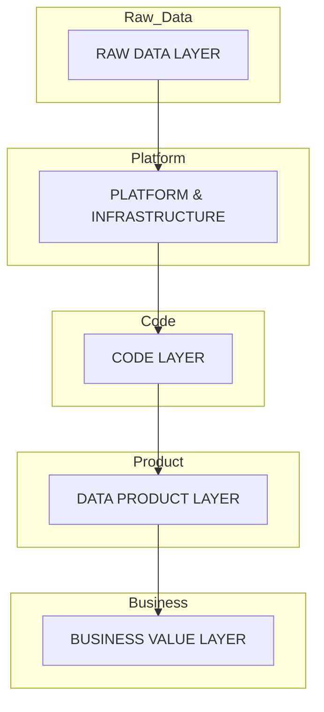

```mermaid
flowchart TB

    subgraph Raw_Data
        Raw["RAW DATA LAYER"]
    end

    subgraph Platform
        PlatformNode["PLATFORM & INFRASTRUCTURE"]
    end

    subgraph Code
        CodeNode["CODE LAYER"]
    end

    subgraph Product
        ProductNode["DATA PRODUCT LAYER"]
    end

    subgraph Business
        BusinessNode["BUSINESS VALUE LAYER"]
    end

    Raw --> PlatformNode --> CodeNode --> ProductNode --> BusinessNode
```

