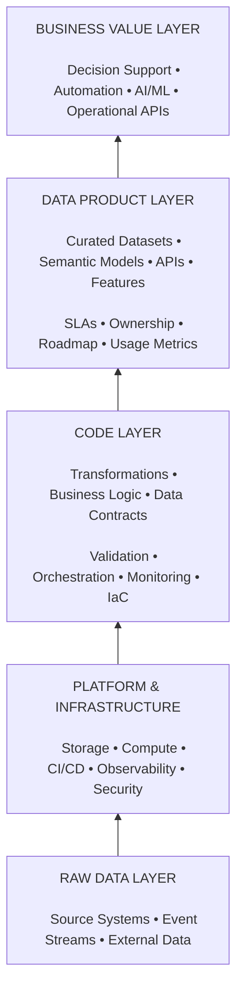

```mermaid
flowchart BT

    Raw["RAW DATA LAYER<br/>
    Source Systems • Event Streams • External Data"]

    Platform["PLATFORM & INFRASTRUCTURE<br/>
    Storage • Compute • CI/CD • Observability • Security"]

    Code["CODE LAYER<br/>
    Transformations • Business Logic • Data Contracts<br/>
    Validation • Orchestration • Monitoring • IaC"]

    Product["DATA PRODUCT LAYER<br/>
    Curated Datasets • Semantic Models • APIs • Features<br/>
    SLAs • Ownership • Roadmap • Usage Metrics"]

    Business["BUSINESS VALUE LAYER<br/>
    Decision Support • Automation • AI/ML • Operational APIs"]

    Raw --> Platform
    Platform --> Code
    Code --> Product
    Product --> Business
```
